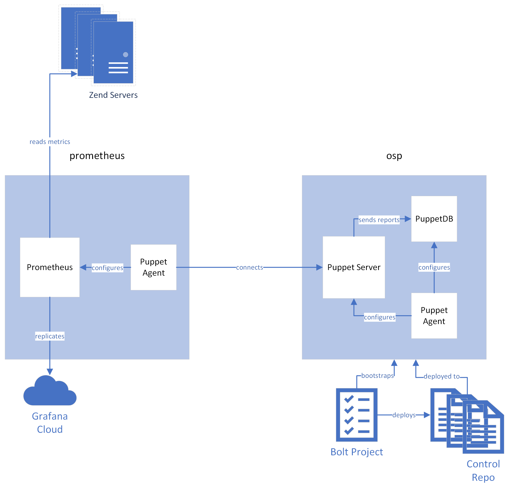

# OSP Workshop

This module provides automation to set up a basic reference architecture for
Open Source Puppet Server, PuppetDB, and Foreman.



## Table of Contents

1. [Description](#description)
1. [Setup - The basics of getting started with osp_workshop](#setup)
    * [What osp_workshop affects](#what-osp_workshop-affects)
    * [Setup requirements](#setup-requirements)
    * [Beginning with osp_workshop](#beginning-with-osp_workshop)
1. [Usage - Configuration options and additional functionality](#usage)
<!-- 1. [Limitations - OS compatibility, etc.](#limitations) -->
<!-- 1. [Development - Guide for contributing to the module](#development) -->

## Description

Using Vagrant and Bolt, bootstrap a monolithic Puppet instance with two nodes:
`osp` and `foreman`. This module will install and configure Puppet Server and
PuppetDB on the `osp` node using
[`theforeman-puppet`](https://forge.puppet.com/modules/theforeman/puppet/readme)
module, configure `/etc/hosts` to ease communication between the nodes, and set
up agents. Then, it configures [r10k](https://github.com/puppetlabs/r10k) to
deploy a [special control
repo](https://github.com/jameslikeslinux/osp-workshop-control-repo) containing
roles and profiles to complete the Foreman installation and integration.

## Setup

### What osp_workshop affects

This module is primarily a [Bolt
project](https://www.puppet.com/docs/bolt/latest/bolt.html) that targets the
Vagrant instances that this module also provides. Exercise caution before
attempting to apply this module to other resources.

### Setup Requirements

This module requires a working [Vagrant](https://www.vagrantup.com/)
installation. The `Vagrantfile` provided in this repo expects the libvirt
backend. You may need to modify it to work with other backends, such as
VirtualBox.

### Beginning with osp_workshop

Start by bringing up the two Vagrant instances.

```
vagrant up
```

Assuming they launch successfully, you should be able to log in to each
instance with:

```
vagrant ssh osp
vagrant ssh foreman
```

and switch to root with `sudo -s`.

For convenience later on, grab the IP address of the `foreman` node with `ip
addr` and add an entry to your host's `/etc/hosts` file (or equivalent) like:

```
192.168.121.89	foreman
```

Remember, your IP address will be different!

Finally, prepare to allow Bolt to connect to these nodes by running:

```
vagrant ssh-config > vagrant-ssh.conf
```

You may need to fixup the resulting config file depending on how you invoke
Bolt. Bolt's `inventory.yaml` is configured to use `vagrant-ssh.conf` to tell
it how to connect.

## Usage

1. Install Bolt modules:
    ```
    bolt module install
    ```
2. Bootstrap the Puppet instance:
    ```
    bolt plan run osp_workshop::bootstrap
    ```
3. Run Puppet on the `foreman` node. This will complete the agent SSL bootstrap
   and install Foreman based on the contents of the control repo.
    ```
    /opt/puppetlabs/bin/puppet agent --test --server osp
    ```
4. Log in to https://foreman/ (default username and password: "admin"). Under
   **Administer->Settings->Authentication**, add `osp` to **Trusted hosts**.
5. Run Puppet on the `osp` node. This will reconfigure Puppet Server to use
   Foreman as an ENC and report to it in addition to PuppetDB.
    ```
    /opt/puppetlabs/bin/puppet agent --test
    ```

<!--
## Limitations

In the Limitations section, list any incompatibilities, known issues, or other
warnings.

## Development

In the Development section, tell other users the ground rules for contributing
to your project and how they should submit their work.

## Release Notes/Contributors/Etc. **Optional**

If you aren't using changelog, put your release notes here (though you should
consider using changelog). You can also add any additional sections you feel are
necessary or important to include here. Please use the `##` header.

[1]: https://puppet.com/docs/pdk/latest/pdk_generating_modules.html
[2]: https://puppet.com/docs/puppet/latest/puppet_strings.html
[3]: https://puppet.com/docs/puppet/latest/puppet_strings_style.html
-->
